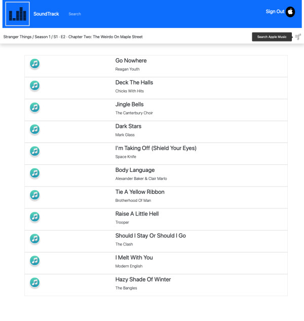
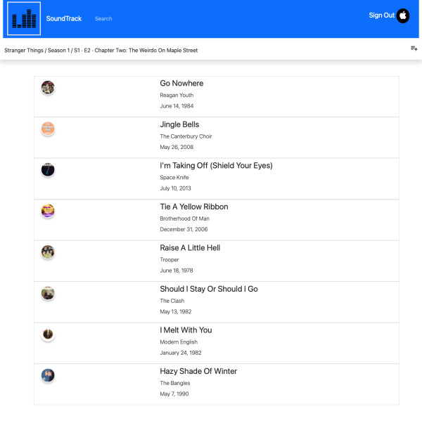
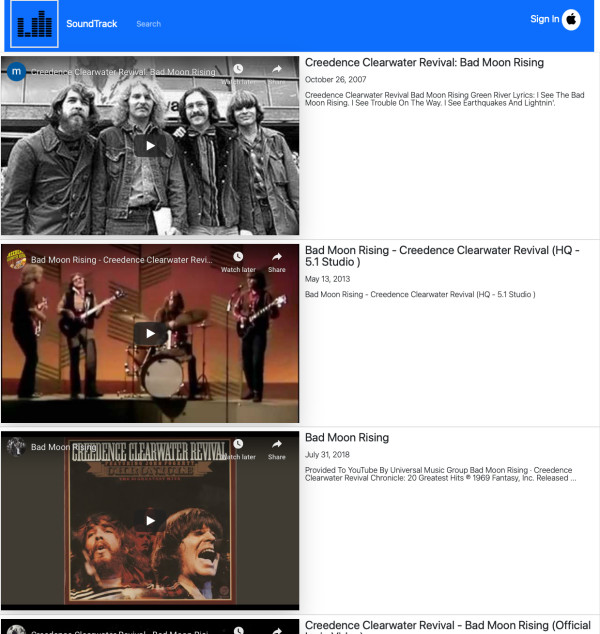

# SoundTracks

https://github.com/trilambda122/Soundtracks

Live project site can be acces here: [SOUNDTRACKS](https://tv-soundtracks.herokuapp.com)

## Table of Contents

[Description](#description)...

[Lessons learned](#Lessons)...

[Technology Used](#Technology)...

[Useage](#useage)...

[Contribitors](#Contribitors)...

[Tests](#Tests)...

[Questions](#Questions)...

[Application Screen Shots](#ScreenShots)...

---
## Description
Have you ever been watching a show and thought, "This show has excellent music, I would sure like to have a playlist of this!". That's the problem Soundtracks is here to help with. Just search for your favorite show, movie, or game, and it will create a playlist in your apple music account. Or if you want to just watch a few songs videos, you can do that too.

This is a React application with utilizes Apple MusicKit and Youtube APIs.

## Lessons
**Apple MusicKit API, and developer console:**  This had a learning curve as little documentation existed outside of Apple's developer site.  Even less documentation regarding MusicKitJS or any web related use of Apple Music beyond a basic player setup. Especially under-documented was how to authenticate a user account without having developer tokens hardcoded into the code directly.

**Apple relies on JSON web tokens:**  Apple uses them for both user tokens and developer tokens.  This was a great experience to learn and understand JWT in depth. 

**Youtube APIv3:**  I learned both how to use the Youtube APIv3 and documentation. The Youtube API documentation was much more manageable and verbose than Apple's, with a larger online community for support. 

**Google's Developer console:**  Along with Quota calculations for Youtube API v3

**Use of Global State and Context hooks within React**


## Technology
- Nodejs
- React
- ExpressJS
- Apple MusicKit
- Youtube APiv3

---
## Useage
In the project directory, you can run:

### `npm run dev`

Runs the app in the development mode.\
Open [http://localhost:3000](http://localhost:3000) to view it in the browser.

---
## Contribitors 

Shane Schilling

---
## Tests
None at this time 

---
## Questions

Github profile can be found here:  http://github.com/trilambda122

Please direct any additonal questions to: trilambda122@gmail.com


---
## ScreenShots


Video Demo


Example of search results for a shows season / episode: 



Example of music restuls found on apple tha could be turned into a playlist inside users apple music account



Youtube song restuls for a given song. 



## Package.json scripts
```java
  "scripts": {
    "test": "echo \"Error: no test specified\" && exit 1",
    "test-client": "cd ./client && npm test",
    "seed": "node seed/seeder.js",
    "start": "if-env NODE_ENV=production && npm run start:prod || npm run dev",
    "start:prod": "node server.js",
    "client": "cd ./client && npm start",
    "install": "cd client && npm install",
    "dev": "concurrently --names 'server,client' --prefix-colors 'yellow,blue' \"node server.js \" \" npm run client \" ",
    "build": "cd client && npm run build",
    "heroku-postbuild": "npm run build"
```

See .env.example
```java
NODE_ENV=dev
TEAM_ID=
KEY_ID=
ALG=
SECRET_KEY=
BASE_URL=
YOUTUBE_API=
```

Create a similar file .env

Run 
```java
npm run dev
```

Output
```java
> Version2@1.0.0 dev
> concurrently --names 'server,client' --prefix-colors 'yellow,blue' "node server.js " " npm run client "

[client] 
[client] > Version2@1.0.0 client
[client] > cd ./client && npm start
[client] 
[client] 
[client] > client@0.1.0 start
[client] > react-scripts start
[client] 
[server] ==> 🌎  Listening on port 8080. Visit http://localhost:8080/ in your browser.
[client] ℹ ｢wds｣: Project is running at http://0.0.0.0:3000/
[client] ℹ ｢wds｣: webpack output is served from 
[client] ℹ ｢wds｣: Content not from webpack is served from /mnt/ap/ap/Soundtracks/client/public
[client] ℹ ｢wds｣: 404s will fallback to /
[client] Starting the development server...
[client] 
[client] Compiled with warnings.
[client] 
[client] src/components/AppleMusic/AppleAuth.js
[client]   Line 29:11:  'auth' is assigned a value but never used  no-unused-vars
[client] 
[client] src/components/Episodes/Episodes.js
[client]   Line 19:5:  React Hook useEffect has missing dependencies: 'selectedSeason.assetLink' and 'setEpisodeResults'. Either include them or remove the dependency array  react-hooks/exhaustive-deps
[client] 
[client] src/components/Playlist/Playlist.js
[client]   Line 1:28:   'useEffect' is defined but never used                                              no-unused-vars
[client]   Line 25:25:  Array.prototype.map() expects a return value from arrow function                   array-callback-return
[client]   Line 85:24:  Array.prototype.map() expects a value to be returned at the end of arrow function  array-callback-return
[client] 
[client] src/components/Playlist/PlaylistItem.js
[client]   Line 9:7:  'id' is assigned a value but never used  no-unused-vars
[client] 
[client] src/components/Seasons/Seasons.js
[client]   Line 10:23:  'selectedSeason' is assigned a value but never used                                                                                                   no-unused-vars
[client]   Line 10:39:  'selectedEpisode' is assigned a value but never used                                                                                                  no-unused-vars
[client]   Line 21:3:   React Hook useEffect has missing dependencies: 'selectedResult.assetLink' and 'setSeasonResults'. Either include them or remove the dependency array  react-hooks/exhaustive-deps
[client] 
[client] src/components/Songs/ShowSongs.js
[client]   Line 30:6:  React Hook useEffect has missing dependencies: 'selectedEpisode.assetLink' and 'setSongResults'. Either include them or remove the dependency array  react-hooks/exhaustive-deps
[client] 
[client] src/components/Songs/Songs.js
[client]   Line 37:5:  React Hook useEffect has missing dependencies: 'getMoiveSongs', 'getShowSongs', 'selectedResult.assetLink', 'selectedResult.assetType', and 'setSongResults'. Either include them or remove the dependency array  react-hooks/exhaustive-deps
[client] 
[client] src/components/Youtube/Youtube.js
[client]   Line 1:28:  'useEffect' is defined but never used  no-unused-vars
[client] 
[client] src/components/Youtube/YoutubeItemList.js
[client]   Line 1:26:  'useEffect' is defined but never used                 no-unused-vars
[client]   Line 4:8:   'api' is defined but never used                       no-unused-vars
[client]   Line 7:19:  Missing '()' invoking a constructor                   new-parens
[client]   Line 8:10:  'setYoutubeVideo' is assigned a value but never used  no-unused-vars
[client]   Line 8:27:  'youtubeVideo' is assigned a value but never used     no-unused-vars
[client]   Line 9:9:   'history' is assigned a value but never used          no-unused-vars
[client]   Line 58:1:  Block is redundant                                    no-lone-blocks
[client] 
[client] Search for the keywords to learn more about each warning.
[client] To ignore, add // eslint-disable-next-line to the line before.
[client] 
```
