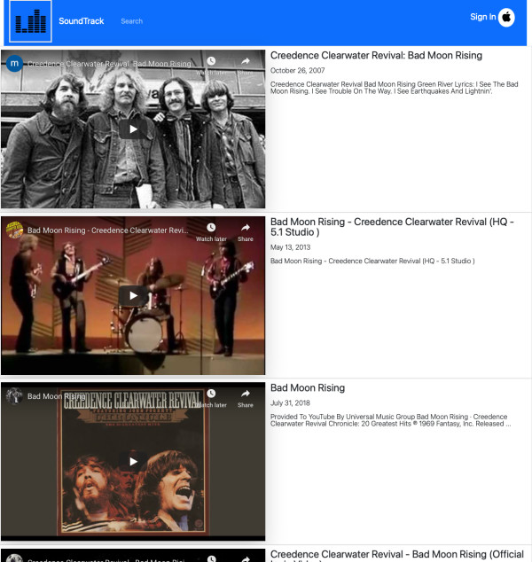

# Project name : Soundtracks
## Live project site can be acces here: (Currently under mainteance)

## Project repo can be here: [Soundtracks](https://github.com/trilambda122/Soundtracks)

---
## Table of Contents

[Description](#description)...

[Installation Requirements](#installtion-requirments)...

[Useage](#useage)...

[License](#License)...

[Contribitors](#Contribitors)...

[Tests](#Tests)...

[Questions](#Questions)...

[Application Screen Shots](#ScreenShots)...

---
## Description
Have you ever been watching a show and thought, "This show has excellent music, I would sure like to have a playlist of this!". That's the problem Soundtracks is here to help with. Just search for your favorite show, movie, or game, and it will create a playlist in your apple music account. Or if you want to just watch a few songs videos, you can do that too.

This is a React application with utilizes Apple MusicKit and Youtube APIs.

---
## Useage
In the project directory, you can run:

### `npm run dev`

Runs the app in the development mode.\
Open [http://localhost:3000](http://localhost:3000) to view it in the browser.

---
## License
NOTICE This application is covered under MIT License license.

---
## Contribitors 

Shane Schilling

---
## Tests
None at this time 

---
## Questions

Github profile can be found here:  http://github.com/trilambda122

Please direct any additonal questions to: trilambda122@gmail.com

---
## ScreenShots
Example of search results for a shows season / episode: 

Example of music restuls found on apple tha could be turned into a playlist inside users apple music account

Youtube song restuls for a given song. 

